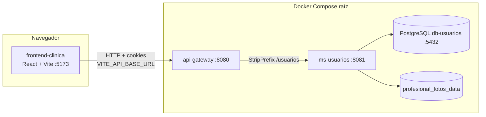

# Arquitectura del sistema

Visión general del repositorio: qué componentes existen hoy, cómo se comunican y qué queda planificado.

---

## Estado del proyecto

| Ámbito | Estado | Notas |
|--------|--------|--------|
| **Identidad y usuarios** (`ms-usuarios`) | Implementado | Registro, login, JWT, refresh, catálogos, panel admin de entidades |
| **API Gateway** | Implementado | Enrutamiento `/usuarios/**`, CORS, Swagger agregado |
| **Frontend SPA** | Parcial | Portales paciente/profesional/admin operativos en identidad; turnos e historial son placeholders |
| **Microservicio de turnos** | No existe en el repo | Rutas UI reservadas (`AdminTurnosPage`, `PACIENTE_PATHS.turnos`, etc.) |
| **Microservicio de historial clínico** | No existe en el repo | Rutas UI reservadas (`AdminHistorialesClinicosPage`, etc.) |

Backlog priorizado: [COSAS-POR-HACER.md](../COSAS-POR-HACER.md).

---

## Diagrama de componentes (actual)



---

## Estructura del repositorio

```text
sistema-historial-turnos-clinica/
├── docker-compose.yml          # Stack completo: DB + ms-usuarios + gateway + frontend
├── README.md                   # Entrada principal del proyecto
├── COSAS-POR-HACER.md          # Backlog P0–P3
├── docs/                       # Documentación técnica transversal
│   ├── API.md                  # Contrato HTTP de ms-usuarios
│   ├── API-GATEWAY.md          # Gateway: rutas, CORS, Swagger
│   ├── ARQUITECTURA.md         # Este archivo
│   ├── ENTIDADES.md            # Modelo JPA
│   ├── SEGURIDAD.md            # JWT, identidad centralizada
│   └── CAMBIOS-*.md            # Notas de cambios por feature
├── api-gateway/                # Spring Cloud Gateway (Java 21)
├── ms-usuarios/                # Microservicio de identidad (Spring Boot 3)
├── frontend-clinica/           # SPA React 19 + Vite 8 + Tailwind 4
├── infra/                      # Compose alternativo (Postgres genérico, sin geo de usuarios)
└── .github/workflows/          # CI: startup checks de ms-usuarios
```

---

## Puertos y servicios (desarrollo local)

| Servicio | Puerto host | Rol |
|----------|-------------|-----|
| `frontend-clinica` | **5173** | SPA (Vite dev server en Docker o `npm run dev`) |
| `api-gateway` | **8080** | Entrada HTTP recomendada para el front |
| `ms-usuarios` | **8081** | API directa (Postman, tests sin gateway) |
| `db-usuarios` | **5432** | PostgreSQL `db_clinica_usuarios` |

Red Docker interna: **`clinica-network`** (bridge).

Volúmenes persistentes:

- **`db_usuarios_data`** — datos PostgreSQL.
- **`profesional_fotos_data`** — fotos de perfil WebP (`PROFESIONAL_FOTO_DIR` en el contenedor). **Backup:** incluir este volumen en la estrategia de respaldo del entorno (junto con la BD); sin backup, las rutas en BD apuntan a archivos inexistentes tras una pérdida del volumen. Ver [ms-usuarios/README-deploy.md](../ms-usuarios/README-deploy.md).

---

## Docker Compose (raíz)

Comando recomendado desde la raíz:

```bash
docker compose up --build -d
```

Servicios levantados:

1. **`db-usuarios`** — Postgres 16; semilla en volumen nuevo: **`init.sql`** (esquema + geo + sentinel).
2. **`ms-usuarios`** — Spring Boot; conecta a `db-usuarios`; monta volumen de fotos.
3. **`api-gateway`** — proxy hacia `ms-usuarios:8081`.
4. **`frontend-clinica`** — Vite con hot-reload (`CHOKIDAR_USEPOLLING=true` para Windows); monta el código fuente como volumen.

Variables compartidas en compose:

- **`APP_ALLOWED_ORIGINS`** → `ms-usuarios` (default `http://localhost:5173`).
- **`APP_GATEWAY_CORS_ALLOWED_ORIGIN`** → gateway (mismo default).

Detalle del gateway: [API-GATEWAY.md](API-GATEWAY.md).

### Alternativas de base de datos

| Opción | Comando | Cuándo usarla |
|--------|---------|---------------|
| **Stack completo (recomendado)** | `docker compose up --build -d` (raíz) | Front + gateway + ms-usuarios + Postgres con `init.sql` completo |
| Solo MS usuarios | `cd ms-usuarios && docker compose up -d` | Desarrollo backend aislado con misma semilla geo |
| Infra genérica (**legacy**) | `cd infra && docker-compose up -d` | Postgres 15 genérico **sin** semilla geo ni esquema de usuarios — no usar para el flujo clínico completo |
| Recrear semilla | `docker compose down -v && docker compose up --build -d` | BD vieja sin provincias/sentinel |

---

## Flujo de una petición autenticada

1. El front llama `{VITE_API_BASE_URL}/usuarios/api/...` con **`Authorization: Bearer`** y **`withCredentials: true`**.
2. El gateway aplica CORS y reenvía a `ms-usuarios` quitando el prefijo `/usuarios`.
3. `JwtAuthFilter` valida el JWT (salvo rutas públicas en `PublicRequestPaths`).
4. `@PreAuthorize` y `AuthorizationRules` aplican rol y ownership.
5. Ante **401** por token expirado, el interceptor Axios del front intenta **`POST /usuarios/api/auth/refresh`** (cookie HttpOnly) y reintenta una vez.

---

## Stack tecnológico

| Capa | Tecnologías |
|------|-------------|
| Backend MS | Java 21, Spring Boot 3, Spring Security, Spring Data JPA, PostgreSQL, JWT (HS256), JavaMail |
| Gateway | Spring Cloud Gateway, springdoc OpenAPI |
| Frontend | React 19, React Router 7, Vite 8, Tailwind CSS 4, Axios, SweetAlert2, browser-image-compression |
| Infra | Docker Compose, GitHub Actions |
| Tests backend | JUnit 5, MockMvc, H2 (perfil `test`) |

---

## Microservicio `ms-usuarios` (capas)

Paquete base: `com.clinica.usuarios`.

| Paquete / carpeta | Contenido |
|-------------------|-----------|
| `controller/` | 13 controladores REST (`Auth`, `Paciente`, `Profesional`, `Administrador`, catálogos, `CuentaSeguridad`, `ProfesionalFoto`) |
| `service/` + `service/impl/` | Lógica de negocio, email, tokens, almacenamiento de fotos |
| `repository/` | Spring Data JPA |
| `model/` | Entidades JPA (`Usuario` + composición 1:1 con Paciente/Profesional/Administrador) |
| `dto/` | Request/response y DTOs de auth |
| `mapper/` | MapStruct o mappers manuales entre entidad y DTO |
| `security/` | `SecurityConfig`, `JwtAuthFilter`, `JwtUtil`, `PublicRequestPaths`, `AuthorizationRules` |
| `config/` | `StartupChecks` |
| `exception/` | `GlobalExceptionHandler`, excepciones de dominio |
| `util/` | Normalización de direcciones, validadores (`UnicidadUsuarioValidator`) |
| `specification/` | JPA Specifications para búsquedas admin |

Detalle operativo: [../ms-usuarios/README.md](../ms-usuarios/README.md).

---

## Frontend (`frontend-clinica`)

| Carpeta | Contenido |
|---------|-----------|
| `src/pages/general/` | Landing, errores globales, bootstrap admin |
| `src/pages/pacientes/` | Portal paciente |
| `src/pages/profesionales/` | Portal profesional |
| `src/pages/administracion/` | Panel admin completo |
| `src/components/` | Formularios compartidos, geo, modales admin |
| `src/context/` | Contextos de sesión por portal (`ProfesionalSessionContext`) |
| `src/hooks/` | Sesión admin, geo, cambio de contraseña con token |
| `src/api/` | `axiosConfig.js` — clientes Axios e interceptores |
| `src/utils/` | Auth, rutas (`portalPaths.js`), helpers de API |
| `src/config/` | `env.js` — lectura de `VITE_API_BASE_URL` |

Mapa completo de rutas: [../frontend-clinica/README.md](../frontend-clinica/README.md#mapa-de-rutas).

---

## Infraestructura legacy (`infra/`)

Carpeta con un **Postgres 15** genérico (`clinica-postgres`) y `init.sql` propio. **No** incluye la semilla geo de Argentina ni el esquema completo de `ms-usuarios`. Preferir el **`docker-compose.yml` de la raíz** o el de `ms-usuarios/` para desarrollo del sistema clínico.

---

## CI/CD

Workflow: [`.github/workflows/ms-usuarios-startup-check.yml`](../.github/workflows/ms-usuarios-startup-check.yml).

- Dispara en push/PR a `main`/`master` cuando cambia `ms-usuarios/`.
- Levanta Postgres, aplica `init.sql`, empaqueta el JAR y ejecuta **`StartupChecks`** en perfil `prod` (modo no-web).
- **No** ejecuta `mvn test` ni levanta el gateway (pendiente P1 en backlog).

---

## Evolución prevista

Cuando existan **ms-turnos** y **ms-historial-clínico**:

1. Añadir rutas en `api-gateway` (p. ej. `/api/turnos`, `/historial/**`).
2. Documentar en `docs/API-<servicio>.md` y `docs/ENTIDADES-<servicio>.md`.
3. Cablear las pantallas placeholder del front a los nuevos endpoints.
4. Mantener **una sola fuente de identidad** (`ms-usuarios`); ver [SEGURIDAD.md](SEGURIDAD.md).
