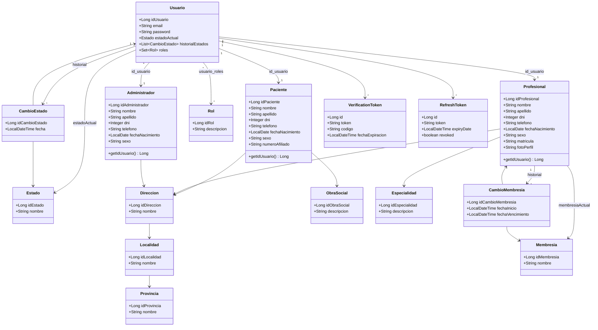
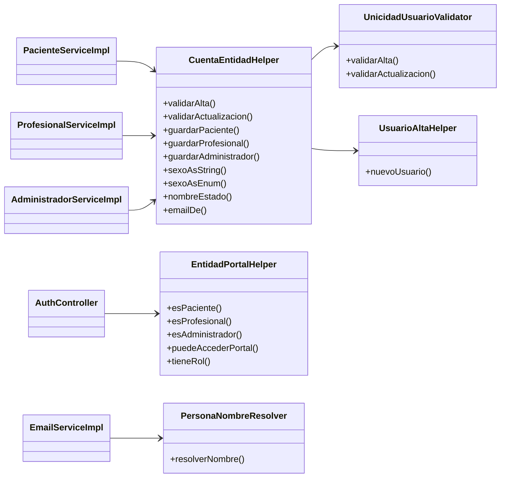
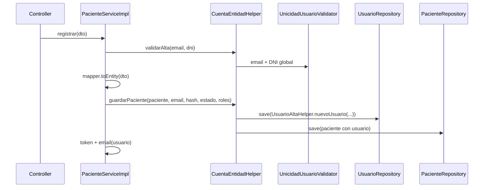

# Refactor del modelo `ms-usuarios`: composición en lugar de herencia JOINED

Documento de referencia del cambio de arquitectura de persistencia y capa de servicios (mayo 2026). Complementa [`ENTIDADES.md`](ENTIDADES.md) (modelo actual) y [`API.md`](API.md) (contrato HTTP, sin cambios de rutas por `idUsuario`).

---

## Resumen ejecutivo

| Antes | Después |
|-------|---------|
| `Paciente`, `Profesional` y `Administrador` **extendían** `Usuario` (`@Inheritance JOINED`) | Tres entidades **independientes** con relación **1:1** opcional hacia `Usuario` |
| Email, password, roles y estado en la jerarquía (tabla `usuarios` + columnas en hijas) | **Solo en `Usuario`**: email, password, `estadoActual`, `roles` |
| Datos personales y DNI en `usuarios` | Datos personales y DNI en `pacientes` / `profesionales` / `administradores` |
| Misma PK `id_usuario` en padre e hijo | PK propia por entidad (`id_paciente`, `id_profesional`, `id_administrador`) + FK `id_usuario` UNIQUE |
| DNI único solo dentro de cada subtipo | **DNI único global** entre las tres tablas de rol |
| Búsquedas con `instanceof` y specs sobre `Usuario` | Repositorios por entidad + `EntidadPortalHelper` / specs dedicadas |

**Contrato API:** las rutas siguen usando **`idUsuario`** (`GET /api/pacientes/{id}`, JWT, `@authorizationRules.esMismoUsuario`). Los IDs de entidad (`idPaciente`, etc.) quedan disponibles para futuros endpoints.

**Base de datos:** un único script [`ms-usuarios/init.sql`](../ms-usuarios/init.sql). Arranque limpio: `docker compose down -v` y `docker compose up --build`.

---

## Decisiones de diseño

| # | Decisión | Implementación |
|---|----------|----------------|
| 1 | Seguir exponiendo `idUsuario` en API | `getIdUsuario()` delega a `entidad.getUsuario().getIdUsuario()`; repos `findByUsuario_IdUsuario` / `findWithUbicacionById(idUsuario)` |
| 2 | DNI único global | `UnicidadUsuarioValidator` consulta paciente + profesional + administrador; UNIQUE por tabla en SQL |
| 3 | Sin migraciones parciales | Solo `init.sql` en volumen nuevo de Postgres |
| 4 | `sexo` en BD como string | Columna `VARCHAR` + CHECK; enum `Sexo` solo en DTOs; MapStruct y `CuentaEntidadHelper.sexoAsString` / `sexoAsEnum` |
| 5 | Una cuenta, un rol de negocio por fila | FK `id_usuario` UNIQUE en cada tabla de rol (un paciente OR profesional OR admin por cuenta; roles múltiples vía `usuario_roles`) |

---

## Diagrama de clases (entidades JPA)

Vista del paquete `com.clinica.usuarios.model` y relaciones de persistencia.



### Notas sobre el diagrama

- **Composición lógica:** `Paciente`, `Profesional` y `Administrador` no heredan de `Usuario`; la cuenta vive en `Usuario` y se enlaza con `@OneToOne` (`id_usuario` UNIQUE).
- **Profesional con rol paciente:** un mismo `Usuario` puede tener fila en `profesionales` y roles `ROLE_PACIENTE` + `ROLE_PROFESIONAL` (portal paciente en modo lectura); no hay fila en `pacientes` en ese caso.
- **Membresía** (`SIN_VERIFICAR`, `INACTIVA`, `ACCESO_INDEFINIDO`, …) es independiente del **estado de cuenta** (`PENDIENTE`, `ACTIVO`, `BLOQUEADO`, `SIN_CONTRASENA`).

---

## Diagrama de capas (servicios y soporte)

Componentes nuevos o centralizados tras el refactor.



---

## Cambios por capa

### 1. Entidades (`model/`)

| Archivo | Cambio |
|---------|--------|
| `Usuario.java` | Solo cuenta; sin `@Inheritance`; sin datos personales |
| `Paciente.java` | PK `idPaciente`; `@OneToOne Usuario`; `@ManyToOne Direccion`, `ObraSocial`; `sexo` String |
| `Profesional.java` | PK `idProfesional`; matrícula, especialidad, membresía, foto |
| `Administrador.java` | PK `idAdministrador`; datos personales + dirección |
| Eliminado | Herencia JPA (`extends Usuario`, `@DiscriminatorColumn`, etc.) |

### 2. Esquema SQL (`init.sql`)

- Tabla `usuarios`: `id_usuario`, `email`, `password`, `id_estado_actual`.
- Tablas `pacientes`, `profesionales`, `administradores`: columnas personales + `id_usuario UNIQUE` + `id_direccion`.
- `sexo VARCHAR(20)` con CHECK `MASCULINO` / `FEMENINO`.
- DNI `UNIQUE` en cada tabla de rol.
- `cambios_membresia.id_profesional` → FK a `profesionales.id_profesional` (no `id_usuario`).
- Eliminados ALTER/migraciones de `sexo` sobre `usuarios`.

### 3. Repositorios

| Repositorio | Métodos relevantes |
|-------------|-------------------|
| `UsuarioRepository` | `findByEmail` (sin specs de persona) |
| `PacienteRepository` | `findByDni`, `findByUsuario_Email`, `findByUsuario_IdUsuario`, `findWithUbicacionById(idUsuario)` |
| `ProfesionalRepository` | Igual patrón + búsqueda por matrícula/membresía |
| `AdministradorRepository` | `findByUsuario_Email`, `findWithUbicacionByUsuarioId` |
| `CambioMembresiaRepository` | `deleteByProfesional_IdProfesional` |

**Specifications nuevas/actualizadas:**

| Clase | Uso |
|-------|-----|
| `PacienteSpecifications` | Admin y búsqueda en zona (filtro `BLOQUEADO` vía join `usuario.estadoActual`) |
| `ProfesionalSpecifications` | Admin + `busquedaEnUbicacion` |
| `AdministradorSpecifications` | `busquedaEnUbicacion` |
| Eliminado | `UsuarioSpecifications` (herencia / `instanceof` en criteria) |

### 4. Servicios (`*ServiceImpl`)

**Patrón de alta**

1. `cuentaEntidadHelper.validarAlta(email, dni)`.
2. Mapper → entidad rol (sin email/password en la entidad).
3. `cuentaEntidadHelper.guardarPaciente|Profesional|Administrador(entidad, email, hash, estado, roles)` → crea `Usuario` + persiste rol.
4. Tokens y emails reciben `entidad.getUsuario()`.

**Patrón de actualización**

- Email, estado y roles en `paciente.getUsuario()` (o equivalente).
- Datos personales y `sexo` en la entidad rol (`CuentaEntidadHelper.sexoAsString` desde DTO).

**Patrón de baja**

- `tokenRepository` / `refreshTokenRepository` por `Usuario`.
- Borrar fila de rol, luego `usuarioRepository.delete(usuario)`.

**Búsqueda profesional en zona**

- Tres consultas (paciente + profesional + administrador), merge y orden por apellido/nombre.
- Detalle por `idUsuario`: resolución en cadena con `Optional.or()` por repositorio.

### 5. Autenticación y portal

| Componente | Cambio |
|------------|--------|
| `EntidadPortalHelper` | Sustituye `instanceof Paciente/Profesional/Administrador` |
| `AuthController` | Portales validados con `puedeAccederPortal` / `esProfesional` |
| `PersonaNombreResolver` | Nombre para emails desde repos por `idUsuario` |
| `EmailService` / `VerificationTokenService` | Firma con `Usuario` (sin cambio de contrato) |

### 6. MapStruct

Mappers leen/escriben:

- `usuario.idUsuario`, `usuario.email`, `usuario.estadoActual`, `usuario.roles`.
- `sexo`: String en entidad ↔ enum en DTO.

### 7. Tests

| Archivo | Cambio |
|---------|--------|
| `TestEntidadFactory` | Helper: `nuevoUsuario` + `paciente` / `profesional` / `administrador` |
| `AuthLoginWithUsersIntegrationTest` | Seed con composición |
| `PacienteCargaActivacionIntegrationTest` | Idem |
| `ProfesionalPacientesBusquedaIntegrationTest` | Idem |

Ejecutar: `mvn test` en `ms-usuarios`.

### 8. Documentación actualizada

| Archivo | Estado |
|---------|--------|
| [`ENTIDADES.md`](ENTIDADES.md) | Modelo composición + ER Mermaid |
| [`ARQUITECTURA.md`](ARQUITECTURA.md) | Referencia a composición |
| Este archivo | Changelog + diagramas de clases |
| `ms-usuarios/README.md` | Enlace en tabla de docs |

Documentos históricos que aún mencionan JOINED en ejemplos puntuales: [`CAMBIOS-ADMIN-ADMINISTRADORES.md`](CAMBIOS-ADMIN-ADMINISTRADORES.md), [`CAMBIOS-REGISTRO-Y-RECHAZO-PROFESIONAL.md`](CAMBIOS-REGISTRO-Y-RECHAZO-PROFESIONAL.md) — el comportamiento actual es el de este documento.

---

## Flujo de alta (secuencia)



---

## Identificadores: qué usar cuándo

| ID | Tabla | Uso actual | Uso futuro |
|----|-------|------------|------------|
| `idUsuario` | `usuarios` | Rutas REST, JWT, `cambios_estado`, tokens | Referencia entre microservicios |
| `idPaciente` | `pacientes` | Interno JPA | Búsquedas/API por entidad paciente |
| `idProfesional` | `profesionales` | `cambios_membresia` | Turnos, historial por profesional |
| `idAdministrador` | `administradores` | Interno JPA | Auditoría admin |

---

## Arranque y verificación

```powershell
# Desde la raíz del repo
docker compose down -v
docker compose up --build
```

```powershell
# Tests unitarios/integración
Set-Location ms-usuarios
mvn test
```

Comprobar en Postgres que existen tablas separadas `usuarios`, `pacientes`, `profesionales`, `administradores` y que **no** hay columnas `nombre`/`dni` en `usuarios`.

---

## Archivos clave (referencia rápida)

```
ms-usuarios/
├── init.sql
├── src/main/java/com/clinica/usuarios/
│   ├── model/Usuario.java, Paciente.java, Profesional.java, Administrador.java
│   ├── repository/*Repository.java, *Specifications.java
│   ├── service/support/
│   │   ├── CuentaEntidadHelper.java
│   │   ├── UsuarioAltaHelper.java
│   │   ├── UnicidadUsuarioValidator.java
│   │   ├── EntidadPortalHelper.java
│   │   └── PersonaNombreResolver.java
│   └── service/impl/*ServiceImpl.java
└── src/test/java/com/clinica/usuarios/testsupport/TestEntidadFactory.java
```

---

## Relación con otros documentos

- Modelo y ER: [`ENTIDADES.md`](ENTIDADES.md)
- Endpoints: [`API.md`](API.md)
- JWT y `@PreAuthorize`: [`SEGURIDAD.md`](SEGURIDAD.md)
- Portal profesional (membresía vs estado): [`CAMBIOS-PORTAL-PROFESIONAL-DASHBOARD.md`](CAMBIOS-PORTAL-PROFESIONAL-DASHBOARD.md)
