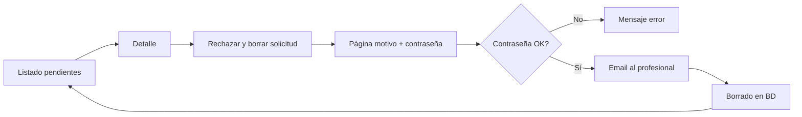

# Cambios: registro profesional y rechazo de solicitudes pendientes

Documentación de las mejoras recientes al **alta de profesionales** (validación de email en UI) y al **panel de administración** (rechazo con motivo, confirmación por contraseña, correo y borrado).

Fecha de referencia: mayo 2026.

---

## 1. Registro profesional — email ya registrado

### Problema

El backend ya rechazaba emails duplicados en `POST /api/profesionales/registro`, pero la SPA mostraba un `alert` genérico y no leía el mensaje del API.

### Backend (`ms-usuarios`)

- **`UnicidadUsuarioValidator`** (`service/support`): validación compartida en alta y actualización de paciente y profesional.
- Mensaje específico si solo el email, solo el DNI, o **ambos** ya están en uso; en actualización admin los textos indican “otro usuario”.
- Responde **400** con `{ "mensaje": "..." }` vía `ReglaDeNegocioException`.
- La validación aplica a **cualquier** usuario en la tabla `usuarios` (paciente, profesional o administrador).

### Frontend (`frontend-clinica`)

- **`Register.jsx` (paciente)** y **`RegistroProfesional.jsx`**: leen `response.data.mensaje` del API (helper `apiErrorMessage` en `src/utils/adminApiError.js`).
- **`RegistroExitosoPaciente.jsx`**: tras confirmar email redirige a **login** del paciente.
- Panel admin pacientes/profesionales: ver [`CAMBIOS-ADMIN-PACIENTES-PROFESIONALES.md`](CAMBIOS-ADMIN-PACIENTES-PROFESIONALES.md).
- **`RegistroProfesional.jsx`**:
  - Estado `error` y banner visible en el formulario (paso 3).
  - En el `catch` del POST: `err.response.data.mensaje` (y fallback a `data.email` en errores de validación del DTO).
  - El error se limpia al modificar `email` o `dni`.
  - Si el mensaje menciona DNI, vuelve al paso 1 para corregirlo.

### Contrato de error (referencia)

| HTTP | Campo | Ejemplo |
|------|--------|---------|
| 400 | `mensaje` | Email o DNI duplicado, reglas de negocio |
| 400 | `{ campo: "..." }` | Errores de `@Valid` en el DTO (`MethodArgumentNotValidException`) |

La SPA de registro profesional debe leer **`mensaje`** (no `message`), alineado con `GlobalExceptionHandler`.

---

## 2. Rechazo y borrado de profesional pendiente (`SIN_VERIFICAR`)

### Objetivo

Permitir que un administrador **rechace** una solicitud de alta que aún no fue verificada: ingresa un **motivo**, confirma con su **contraseña**, se **notifica por email** al profesional y se **elimina** el registro del sistema.

### Flujo de usuario (admin)



1. **Listado:** `/internal/admin/panel/profesionales-pendientes` — `GET /api/profesionales?membresia=SIN_VERIFICAR`.
2. **Detalle:** `…/profesionales-pendientes/{id}` — botón **「Rechazar y borrar solicitud」** (solo si `membresiaActual === 'SIN_VERIFICAR'`).
3. **Rechazo:** `…/profesionales-pendientes/{id}/rechazar` — motivo (10–1000 caracteres) + contraseña del admin + **「Confirmar borrado de profesional pendiente」**.
4. Tras éxito: vuelve al listado con mensaje flash (state de React Router).

### Rutas frontend

| Ruta | Componente |
|------|------------|
| `…/profesionales-pendientes` | `ProfesionalesPendientesPage.jsx` |
| `…/profesionales-pendientes/:idProfesional` | `ProfesionalPendienteDetallePage.jsx` |
| `…/profesionales-pendientes/:idProfesional/rechazar` | `ProfesionalPendienteRechazarPage.jsx` |

Helper en `portalPaths.js`: `ADMIN_PATHS.profesionalPendienteRechazar(id)`.

### API

| Método | Ruta | Rol | Body |
|--------|------|-----|------|
| POST | `/api/profesionales/{id}/rechazar-pendiente` | `ROLE_ADMINISTRADOR` | `{ "motivo": string, "password": string }` |

**Validaciones:**

- `motivo`: obligatorio, 10–1000 caracteres (`RechazarProfesionalPendienteDTO`).
- `password`: contraseña del administrador autenticado (email del JWT).
- El profesional debe tener membresía actual **`SIN_VERIFICAR`**; si no → **400** con `mensaje` explicativo.
- Contraseña incorrecta → **400**, `mensaje`: *"Contraseña incorrecta."*

**Respuesta exitosa (200):**

```json
{
  "mensaje": "El profesional fue notificado y su solicitud fue eliminada del sistema."
}
```

### Orden de operaciones en el servidor

1. Cargar administrador por email del JWT y validar `password` con `PasswordEncoder`.
2. Cargar profesional y comprobar `SIN_VERIFICAR`.
3. **`EmailService.enviarEmailRechazoProfesionalPendiente`** — envío **síncrono** (no `@Async`) para garantizar el correo antes del borrado. Si falla el SMTP, la transacción no completa el borrado.
4. **`eliminarProfesionalPendienteEnCascada`**:
   - Borrar archivo de foto en disco (si existe).
   - `VerificationTokenRepository.deleteByUsuario`
   - `RefreshTokenRepository.deleteByUsuario`
   - `CambioMembresiaRepository.deleteByProfesional_IdUsuario`
   - `CambioEstadoRepository.deleteByUsuario_IdUsuario`
   - `ProfesionalRepository.delete(profesional)` y `UsuarioRepository.delete(usuario)` (composición 1:1 — ver [`CAMBIOS-MODELO-COMPOSICION-USUARIOS.md`](CAMBIOS-MODELO-COMPOSICION-USUARIOS.md)).

Si quedan FK externas (turnos, historiales futuros) → **400** con mensaje de registros asociados.

### Email al profesional

- **Asunto:** `Solicitud profesional no aprobada - Clínica UTN`
- **Contenido:** indica que la solicitud **no ha sido aprobada** e incluye el **motivo** informado por administración (texto escapado en HTML).
- Implementación: `EmailServiceImpl.enviarEmailRechazoProfesionalPendiente`.

### Archivos principales

| Capa | Archivo |
|------|---------|
| DTO | `dto/request/RechazarProfesionalPendienteDTO.java` |
| Servicio | `ProfesionalServiceImpl.rechazarYBorrarProfesionalPendiente` |
| Controlador | `ProfesionalController.rechazarPendiente` |
| Email | `EmailService` / `EmailServiceImpl` |
| SPA detalle | `ProfesionalPendienteDetallePage.jsx` |
| SPA rechazo | `ProfesionalPendienteRechazarPage.jsx` |

### Relación con verificación positiva

| Acción admin | Endpoint | Efecto |
|--------------|----------|--------|
| Aprobar matrícula | `PUT /{id}/verificar-matricula` | Membresía → `INACTIVA`, email de aprobación |
| Rechazar solicitud | `POST /{id}/rechazar-pendiente` | Email de rechazo + borrado físico del usuario |

Ambas rutas aplican solo en el contexto de revisión de profesionales; el rechazo exige explícitamente **`SIN_VERIFICAR`**.

---

## 3. Verificación manual sugerida

### Registro — email duplicado

1. Registrar un profesional con un email válido.
2. Intentar otro registro con el **mismo email**.
3. En el paso 3 debe mostrarse el mensaje del backend en el banner rojo (sin `alert` genérico).

### Rechazo pendiente

1. Admin: listado de pendientes → detalle de un `SIN_VERIFICAR`.
2. **Rechazar y borrar** → completar motivo (≥ 10 caracteres) y contraseña correcta.
3. Comprobar correo al profesional y que el registro desaparece del listado.
4. Probar contraseña incorrecta: debe mostrarse *Contraseña incorrecta.* sin borrar ni enviar mail.
5. Profesional ya verificado (`INACTIVA` / otra membresía): botón de rechazo no visible; la página `/rechazar` muestra aviso.

---

## 4. Documentos relacionados

- [`API.md`](API.md) — tabla de endpoints de profesionales.
- [`CAMBIOS-PORTAL-PROFESIONAL-DASHBOARD.md`](CAMBIOS-PORTAL-PROFESIONAL-DASHBOARD.md) — dashboard y flujo de membresía.
- [`SEGURIDAD.md`](SEGURIDAD.md) — JWT, roles y `POST /api/seguridad/verificar-password-actual` (patrón similar al de catálogos admin).
