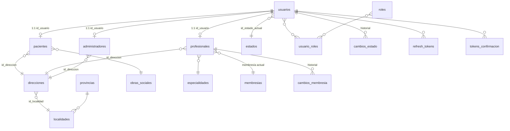

# Entidades y modelo de datos

Este documento describe el **modelo de persistencia** del único microservicio de dominio presente hoy en el repo: **`ms-usuarios`**. El **API Gateway** no define entidades JPA (solo enruta).

**Changelog del refactor (composición, diagrama de clases, capas):** [`CAMBIOS-MODELO-COMPOSICION-USUARIOS.md`](CAMBIOS-MODELO-COMPOSICION-USUARIOS.md).

Los futuros microservicios (**turnos**, **historial**, etc.) tendrán **su propia base de datos** (database-per-service); las referencias a “usuario” o “paciente” en otros MS deben ser por **identificador estable** (`idUsuario`, y en el futuro `idPaciente` / `idProfesional` según contrato) sin tablas duplicadas de credenciales — ver [`SEGURIDAD.md`](SEGURIDAD.md).

---

## Visión general (`ms-usuarios`)

- **Composición 1:1** (sin herencia JPA): **`usuarios`** solo almacena la **cuenta** (email, password hash, estado actual, roles). Cada rol de negocio tiene tabla propia con PK independiente y FK **`id_usuario`** única hacia `usuarios`.
- **`Paciente`**, **`Profesional`** y **`Administrador`** guardan datos personales (`nombre`, `apellido`, `dni`, `telefono`, `fecha_nacimiento`, **`sexo`** como string) y FK **`id_direccion`**.
- **DNI único global**: el mismo número no puede repetirse entre `pacientes`, `profesionales` y `administradores` (validación en aplicación + unicidad por tabla).
- Estados de cuenta: **`estados`** + histórico **`cambios_estado`** (auditoría sobre `usuarios`).
- Tokens de verificación de email: **`tokens_confirmacion`** (`VerificationToken`).
- Sesiones largas: **`refresh_tokens`** vinculados a **`usuarios`**.

---

## Diagrama de clases JPA (detalle)

Diagrama completo con atributos y capa de servicios: [`CAMBIOS-MODELO-COMPOSICION-USUARIOS.md#diagrama-de-clases-entidades-jpa`](CAMBIOS-MODELO-COMPOSICION-USUARIOS.md#diagrama-de-clases-entidades-jpa).

## Diagrama simplificado (Mermaid ER)

---

## Entidades por bloque

### Identidad y personas

| Entidad | Tabla | PK | Descripción |
|---------|-------|-----|-------------|
| **`Usuario`** | `usuarios` | `id_usuario` | Cuenta: email, password (hash), FK estado actual, roles N:N. Sin datos personales. |
| **`Paciente`** | `pacientes` | `id_paciente` | Datos personales + FK `id_usuario` (única) + `id_direccion` + obra social / afiliado. |
| **`Profesional`** | `profesionales` | `id_profesional` | Datos personales + FK `id_usuario` + matrícula, especialidad, foto, membresía actual. |
| **`Administrador`** | `administradores` | `id_administrador` | Datos personales + FK `id_usuario` + `id_direccion`. |

En APIs REST el path sigue usando **`idUsuario`** (el de la cuenta) para localizar la fila de rol vía `findByUsuario_IdUsuario` / `findWithUbicacionById(idUsuario)`.

### Seguridad y ciclo de vida

| Entidad | Tabla | Descripción |
|---------|-------|-------------|
| **`Rol`** | `roles` | `descripcion` única (ej. `ROLE_PACIENTE`, `ROLE_PROFESIONAL`, `ROLE_ADMINISTRADOR`). |
| **`Estado`** | `estados` | Nombre único: ej. `PENDIENTE`, `ACTIVO`, `BLOQUEADO`, `SIN_CONTRASENA`. |
| **`CambioEstado`** | `cambios_estado` | Usuario, estado, fecha (auditoría). |
| **`VerificationToken`** | `tokens_confirmacion` | Token y código de 6 dígitos; expiración; FK usuario. |
| **`RefreshToken`** | `refresh_tokens` | Token opaco, usuario, expiración, revocado. |

### Catálogos

| Entidad | Tabla | Relaciones |
|---------|-------|------------|
| **`Provincia`** | `provincias` | 1 — N **Localidad**. Incluye fila reservada `SIN ESPECIFICAR`. |
| **`Localidad`** | `localidades` | N — 1 **Provincia**; único `(nombre, provincia)`. |
| **`Direccion`** | `direcciones` | N — 1 **Localidad**; referenciada por paciente, profesional y administrador. |
| **`Especialidad`** | `especialidades` | Usada por **Profesional**. |
| **`ObraSocial`** | `obras_sociales` | Usada por **Paciente**. |
| **`Membresia`** | `membresias` | **Profesional** tiene membresía actual + historial **`CambioMembresia`** (`id_profesional`). |

**Membresía vs estado de cuenta:** la membresía regula el ciclo del staff; el estado de la cuenta (`usuarios.id_estado_actual`) regula confirmación de email y bloqueos. Matriz: [`CAMBIOS-PORTAL-PROFESIONAL-DASHBOARD.md`](CAMBIOS-PORTAL-PROFESIONAL-DASHBOARD.md#membresía-vs-estado-matriz-de-referencia).

---

## Claves e IDs

- **`Usuario.idUsuario`**: identificador expuesto en JWT y rutas (`/api/pacientes/{id}`, etc.).
- **`id_paciente`**, **`id_profesional`**, **`id_administrador`**: PKs internas; búsquedas futuras por entidad usarán estos IDs cuando el contrato de API lo defina.
- En autorización frecuente comparar **`id` de ruta** con el usuario autenticado — ver `authorizationRules` en [`SEGURIDAD.md`](SEGURIDAD.md).

---

## Arranque desde cero

El esquema y la semilla viven en **`ms-usuarios/init.sql`**. Para Docker: borrar el volumen de Postgres y levantar de nuevo (`docker-compose up --build`) para aplicar el modelo sin migraciones parciales.

---

## Microservicios aún no en el repo

Cuando existan **ms-turnos**, **ms-historial-clínico**, etc., conviene añadir **`docs/ENTIDADES-<servicio>.md`** por servicio con sus tablas y cómo referencian **`idUsuario`** (o IDs de entidad) sin replicar tablas de login.
