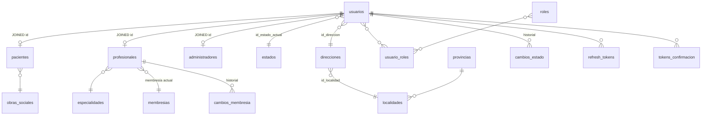

# Entidades y modelo de datos

Este documento describe el **modelo de persistencia** del único microservicio de dominio presente hoy en el repo: **`ms-usuarios`**. El **API Gateway** no define entidades JPA (solo enruta).

Los futuros microservicios (**turnos**, **historial**, etc.) tendrán **su propia base de datos** (database-per-service); las referencias a “usuario” o “paciente” en otros MS deben ser por **identificador estable** (`idUsuario`, email según contrato) sin tablas duplicadas de credenciales — ver [`SEGURIDAD.md`](SEGURIDAD.md).

---

## Visión general (`ms-usuarios`)

- Herencia **JOINED**: tabla **`usuarios`** (padre) + tablas hijas **`pacientes`**, **`profesionales`**, **`administradores`** (`@PrimaryKeyJoinColumn`: mismo id que `id_usuario`).
- Identidad y RBAC viven aquí; **roles** en tabla **`roles`**, relación **N:N** con usuarios vía **`usuario_roles`**.
- Estados de cuenta: **`estados`** + histórico **`cambios_estado`** (auditoría).
- Tokens de verificación de email: tabla **`tokens_confirmacion`** (`VerificationToken`).
- Sesiones largas: **`refresh_tokens`** vinculados a **`usuarios`**.

---

## Diagrama simplificado (Mermaid)

---

## Entidades por bloque

### Identidad y personas

| Entidad | Tabla | Descripción |
|---------|-------|-------------|
| **`Usuario`** | `usuarios` | Email, password (hash), nombre, apellido, DNI, teléfono, fecha nacimiento, FK **`id_direccion`** (obligatoria), FK estado actual, roles N:N. La localidad se obtiene vía `direccion.localidad`. |
| **`Paciente`** | `pacientes` | Extiende `Usuario`; FK obligatoria **obra social**, `numero_afiliado` opcional. |
| **`Profesional`** | `profesionales` | Matrícula única, FK **especialidad**, foto perfil (ruta), FK **membresía actual**, historial cambios membresía. |
| **`Administrador`** | `administradores` | Sin campos extra por ahora; extiende `Usuario`. |

### Seguridad y ciclo de vida

| Entidad | Tabla | Descripción |
|---------|-------|-------------|
| **`Rol`** | `roles` | `descripcion` única (ej. `ROLE_PACIENTE`, `ROLE_PROFESIONAL`, `ROLE_ADMINISTRADOR`). |
| **`Estado`** | `estados` | Nombre único: ej. `PENDIENTE`, `ACTIVO`, `BLOQUEADO`. |
| **`CambioEstado`** | `cambios_estado` (convención JPA) | Usuario, estado, fecha (auditoría). |
| **`VerificationToken`** | `tokens_confirmacion` | Token y **código** de 6 dígitos para confirmación de email; expiración; OneToOne con usuario. |
| **`RefreshToken`** | `refresh_tokens` | Token opaco, usuario, expiración, revocado. |

### Catálogos

| Entidad | Tabla | Relaciones |
|---------|-------|------------|
| **`Provincia`** | `provincias` | 1 — N **Localidad**. Incluye fila reservada `SIN ESPECIFICAR`. |
| **`Localidad`** | `localidades` | N — 1 **Provincia**; único `(nombre, provincia)`. Al crear localidad se genera dirección sentinel. |
| **`Direccion`** | `direcciones` | N — 1 **Localidad**; único `(nombre, localidad)`. Por localidad existe `SIN ESPECIFICAR` para reasignar usuarios al borrar otras direcciones. |
| **`Especialidad`** | `especialidades` | Usada por **Profesional**. |
| **`ObraSocial`** | `obras_sociales` | Usada por **Paciente**. |
| **`Membresia`** | `membresias` | Nombre único (ej. `SIN_VERIFICAR`, `ACTIVA`, `INACTIVA`); **Profesional** tiene membresía actual + historial **`CambioMembresia`**. |
| **`CambioMembresia`** | `cambios_membresia` | Profesional, membresía anterior/nueva, fecha (auditoría de cambios de membresía). |

**Sentinel `SIN ESPECIFICAR`:** en especialidades, obras sociales, provincias, localidades y direcciones. No debe crearse manualmente por admin con ese nombre; sirve para mantener FK al eliminar registros de catálogo o direcciones en uso.

---

## Claves e IDs

- **`Usuario.idUsuario`** es la clave primaria compartida en la jerarquía JOINED (paciente/profesional/administrador usan el mismo valor en su tabla hija).
- En APIs de autorización frecuente comparar **`id` de ruta** con el usuario autenticado — ver bean `authorizationRules` en [`SEGURIDAD.md`](SEGURIDAD.md).

---

## Microservicios aún no en el repo

Cuando existan **ms-turnos**, **ms-historial-clínico**, etc., conviene añadir una subsección o archivo **`docs/ENTIDADES-<servicio>.md`** por servicio con sus tablas y cómo referencian **`idUsuario`** (o IDs externos) sin replicar tablas de login.
