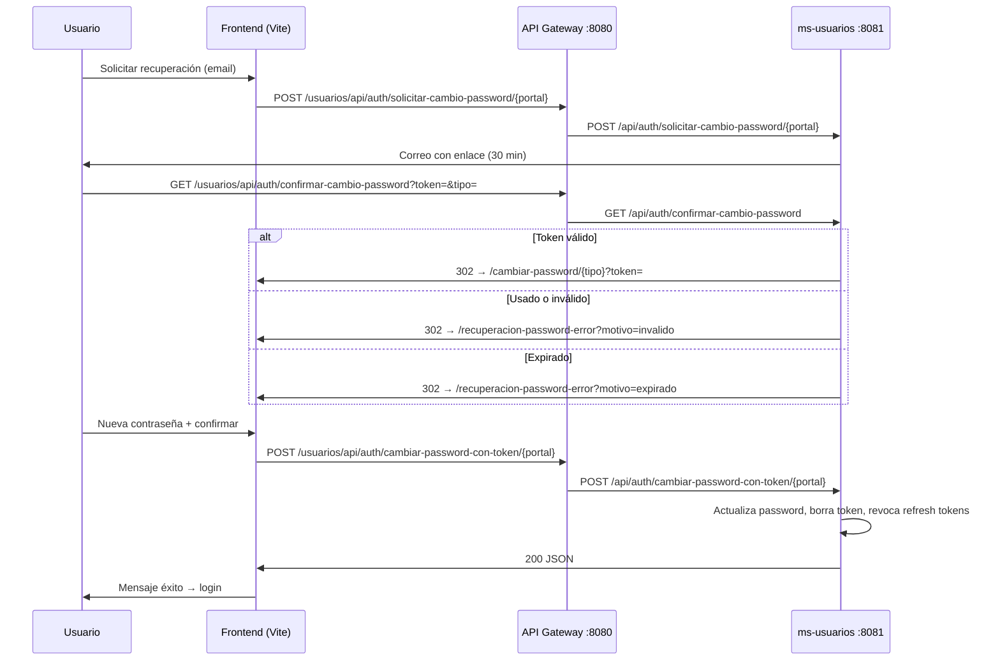

# Recuperación de contraseña y flujos relacionados (front + `ms-usuarios`)

Documentación de los cambios en el flujo **“¿Olvidaste tu contraseña?”** para los tres portales (paciente, profesional, administrador), la pantalla de error en la SPA, la seguridad de rutas públicas y la prevención de **doble envío** al guardar la nueva clave.

Relacionado: [`API.md`](API.md) (tabla de rutas), [`SEGURIDAD.md`](SEGURIDAD.md) (filtros y `permitAll`), [`frontend-clinica/README.md`](../frontend-clinica/README.md) (rutas SPA).

---

## Resumen

| Tema | Comportamiento |
|------|----------------|
| Validez del enlace en el correo | **30 minutos** desde la solicitud |
| Token de un solo uso | Tras cambiar la contraseña, el token se **elimina** de `tokens_confirmacion` |
| Enlace usado o inválido | Redirect a `/recuperacion-password-error?tipo=…&motivo=invalido` |
| Enlace expirado | Redirect con `motivo=expirado` |
| Cambio con token | **Sin JWT**; rutas públicas en `SecurityConfig` |
| Doble clic / doble POST | Bloqueo con `lockRef` + candado global en el hook (un solo `axios.post`) |

---

## Flujo end-to-end



---

## Backend (`ms-usuarios`)

### Endpoints

| Método | Ruta (en el MS) | Descripción |
|--------|-----------------|-------------|
| POST | `/api/auth/solicitar-cambio-password/paciente` | Body: `{ "email" }`. Usuario debe estar **ACTIVO** y tener rol paciente. |
| POST | `/api/auth/solicitar-cambio-password/profesional` | Igual con rol profesional. |
| POST | `/api/auth/solicitar-cambio-password/admin` | Igual con rol administrador. |
| GET | `/api/auth/confirmar-cambio-password` | Query: `token`, `tipo` (`paciente` \| `profesional` \| `admin`). Redirect HTTP a la SPA. |
| POST | `/api/auth/cambiar-password-con-token/paciente` | Body: `{ "token", "passwordNueva" }`. Política de contraseña fuerte (DTO). |
| POST | `/api/auth/cambiar-password-con-token/profesional` | Igual. |
| POST | `/api/auth/cambiar-password-con-token/admin` | Igual. |

Implementación principal: `AuthController.java`, lógica compartida en `cambiarPasswordConTokenPorTipo` y `solicitarCambioPasswordPorTipo`.

### Token en base de datos

- Tabla: `tokens_confirmacion` (misma entidad que confirmación de email en registro).
- Al solicitar recuperación: se **borran** tokens previos del usuario y se crea uno nuevo.
- Expiración: `LocalDateTime.now().plusMinutes(30)` (fijado en código, no en `application.yml`).
- Tras un cambio exitoso: `verificationTokenRepository.delete(verificationToken)`.
- Se revocan todos los **refresh tokens** del usuario (`refreshTokenService.revokeAllForUser`).

### Correo

- Servicio: `EmailServiceImpl.enviarEmailRecuperacionPassword`.
- El HTML indica que el enlace es válido por **30 minutos**.
- El botón apunta a: `{APP_URL}/usuarios/api/auth/confirmar-cambio-password?token=…&tipo=…`  
  (`APP_URL` = base del **gateway**, p. ej. `http://localhost:8080`).

### Redirects tras validar el enlace (GET confirmar)

Helper: `AccountConfirmationRedirectHelper.errorRecuperacionPassword(portal, ex)` →

`{app.frontend-url}/recuperacion-password-error?tipo={portal}&motivo={invalido|expirado}`

Mensajes backend que alimentan `motivo`:

| Situación | Excepción / mensaje |
|-----------|---------------------|
| Token inexistente o ya usado | `RecursoNoEncontradoException`: *"Este enlace ya fue utilizado o no es válido."* |
| Token expirado | `ReglaDeNegocioException`: *"El enlace de recuperación ha expirado (válido por 30 minutos)."* |

### Seguridad

- Rutas bajo `/api/auth/**` en `permitAll`, más matchers explícitos para `cambiar-password-con-token` y prefijo `/usuarios/api/auth/**` por si el gateway no aplica `StripPrefix`.
- `JwtAuthFilter` omite estas rutas vía `PublicRequestPaths.shouldBypassJwtFilter` (normaliza path y quita prefijo `/usuarios` si llegara sin strip).
- Las peticiones de recuperación deben usar **`clienteAxiosPublic`**, que **no** envía `Authorization` y elimina cualquier header Bearer residual.

**Requisito de despliegue:** el contenedor **`api-gateway`** debe estar levantado si el front usa `VITE_API_BASE_URL=http://localhost:8080`. Sin gateway, la URL debe ser `http://localhost:8081` **sin** el segmento `/usuarios` en el path (el front actual siempre usa `/usuarios/api/...`).

---

## Frontend (`frontend-clinica`)

### Rutas SPA (`portalPaths.js` + `App.jsx`)

| Portal | Solicitar correo | Formulario nueva clave | Error enlace |
|--------|------------------|------------------------|--------------|
| Paciente | `/recuperar-password/paciente` | `/cambiar-password/paciente?token=` | `/recuperacion-password-error?tipo=paciente&motivo=` |
| Profesional | `/recuperar-password/profesional` | `/cambiar-password/profesional?token=` | `tipo=profesional` |
| Admin | `/recuperar-password/admin` | `/cambiar-password/admin?token=` | `tipo=admin` |

Pantalla de error: `src/pages/general/RecuperacionPasswordError.jsx`

| `motivo` | Texto mostrado |
|----------|----------------|
| `invalido` | Enlace ya utilizado o no válido; botón para solicitar nuevo correo. |
| `expirado` | Enlace expirado (30 min); botón para solicitar nuevo correo. |

### Cliente HTTP

- `clienteAxiosPublic` (`src/api/axiosConfig.js`): sin interceptor de refresh en 401; interceptor de request que **borra** `Authorization`.
- Rutas de recuperación listadas en `SKIP_REFRESH_ON_401` / `shouldSkipAuthRecoveryHandling`.

### Hook compartido: `useSubmitCambioPasswordConToken`

Archivo: `src/hooks/useSubmitCambioPasswordConToken.js`

Responsabilidades:

- Validar token y coincidencia de contraseñas.
- Un solo `POST` a `/usuarios/api/auth/cambiar-password-con-token/{suffix}`.
- Estados UI: `isSubmitting`, `completado`, `error`, `success`.

**Prevención de doble POST (mismo milisegundo):**

1. En cada página (`CambiarPasswordPaciente.jsx`, etc.): `lockRef` — en `handleSubmit`, tras `preventDefault()`, si `lockRef.current` → `return`; si no, `lockRef.current = true` de forma **sincrónica**.
2. En el hook: `globalApiLock.inFlight` a nivel módulo; segunda invocación paralela retorna `{ skipped: true }` sin llamar a axios.
3. Formulario: solo `onSubmit={handleSubmit}`; botón **solo** `type="submit"` (sin `onClick` duplicado).
4. `finally` en la página: si el resultado no es `completed`, `lockRef.current = false`.

Páginas que usan el hook:

- `src/pages/pacientes/CambiarPasswordPaciente.jsx`
- `src/pages/profesionales/CambiarPasswordProfesional.jsx`
- `src/pages/administracion/CambiarPasswordAdmin.jsx`

Utilidad de errores de API: `src/utils/recuperacionPasswordError.js` (`manejarErrorCambioPasswordConToken`, redirección a pantalla de error si el mensaje indica enlace usado/expirado).

### Registro profesional — aviso de foto

En `RegistroProfesional.jsx` (paso 3), antes del input de foto:

- La imagen debe ser de **ámbito profesional**.
- Será **visible para todos los pacientes y usuarios** del sistema.

---

## Pruebas manuales sugeridas

1. `docker compose up -d api-gateway ms-usuarios frontend-clinica db-usuarios`
2. Solicitar recuperación → abrir enlace del mail → una sola petición POST en Network (200).
3. Reabrir el mismo enlace → pantalla de error `motivo=invalido` (no JSON crudo en el navegador).
4. Esperar > 30 min o usar token viejo → `motivo=expirado`.
5. Login con la nueva contraseña.

### Comandos curl (diagnóstico)

Con gateway (esperado **404** por token falso, **no 401**):

```bash
curl -s -o /dev/null -w "%{http_code}" -X POST "http://localhost:8080/usuarios/api/auth/cambiar-password-con-token/paciente" \
  -H "Content-Type: application/json" \
  -d "{\"token\":\"prueba\",\"passwordNueva\":\"Aa1!aaaa\"}"
```

---

## Tests automáticos

`SecurityAndAuthIntegrationTest`:

- `POST /api/auth/cambiar-password-con-token/paciente` sin JWT → **404** (no 401).
- Con `Authorization: Bearer` inválido en la misma ruta → **404** (el filtro JWT no bloquea la ruta pública).

---

## Archivos tocados (referencia)

| Área | Archivos principales |
|------|----------------------|
| Backend auth | `AuthController.java`, `AccountConfirmationRedirectHelper.java`, `SecurityConfig.java`, `PublicRequestPaths.java`, `JwtAuthFilter.java`, `EmailServiceImpl.java` |
| Front recuperación | `RecuperacionPasswordError.jsx`, `useSubmitCambioPasswordConToken.js`, `recuperacionPasswordError.js`, `axiosConfig.js`, `CambiarPassword*.jsx`, `SolicitarCambioPassword*.jsx` |
| Registro profesional | `RegistroProfesional.jsx` |
| Tests | `SecurityAndAuthIntegrationTest.java` |
